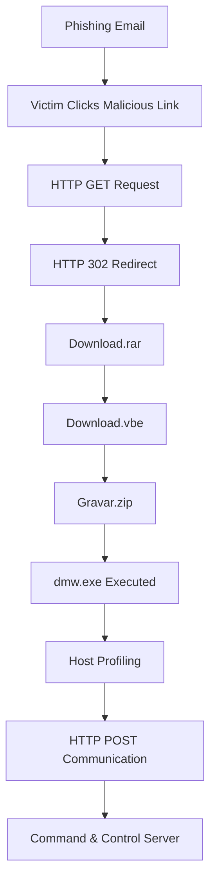
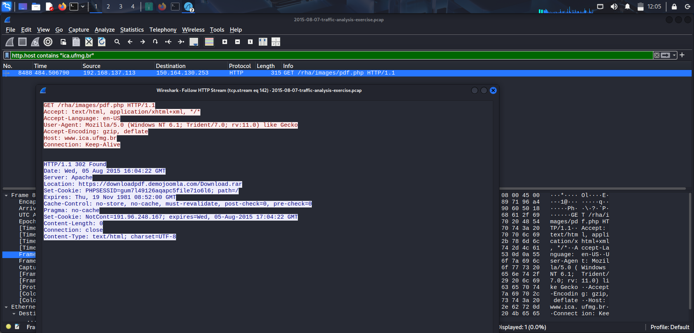
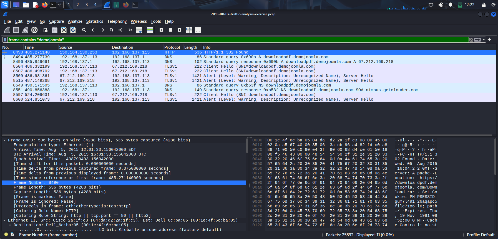
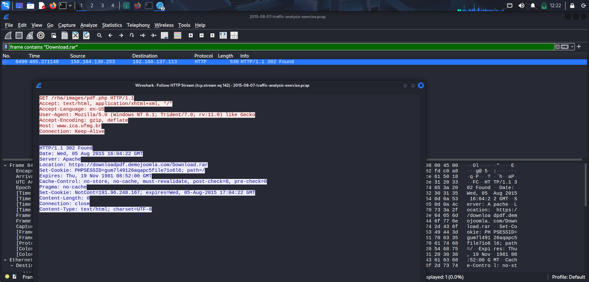
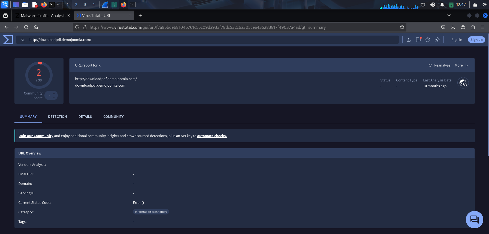
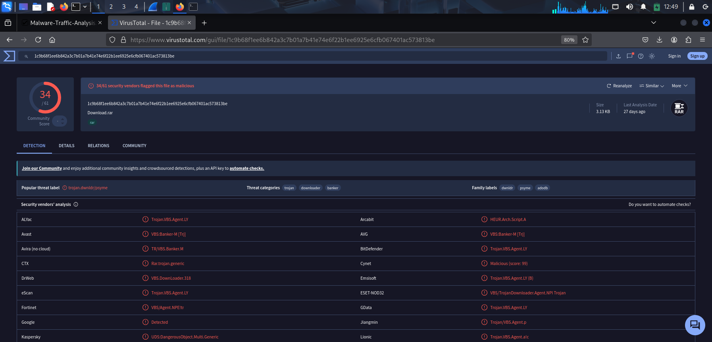
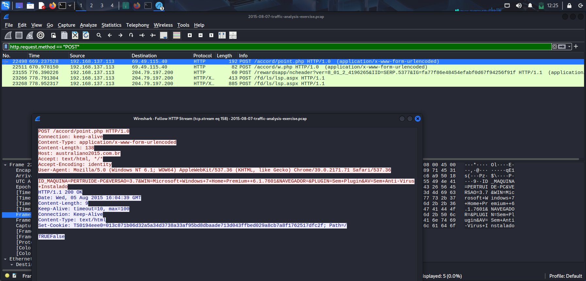
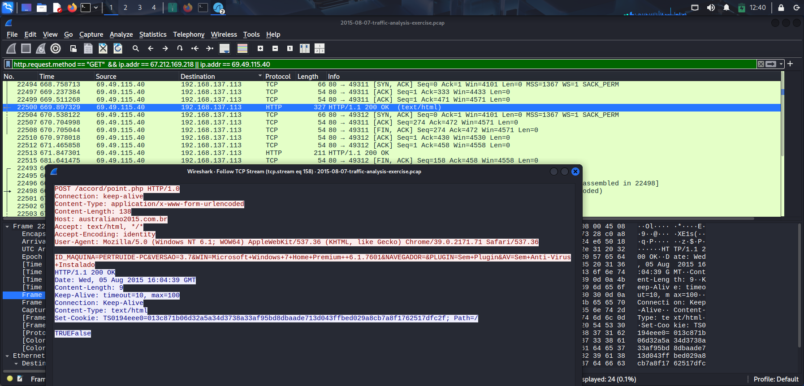
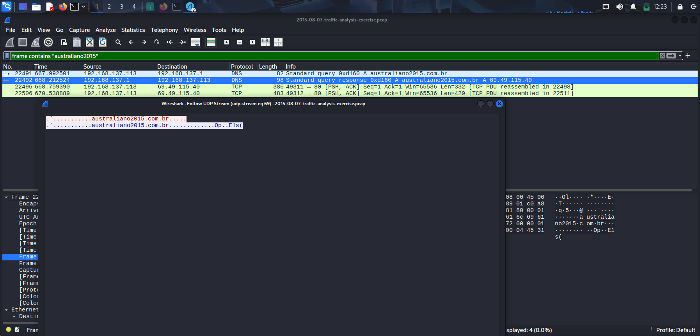

# Banking Trojan Incident Response Case Study

> A beginner-friendly SOC investigation documenting the analysis of a Banking Trojan infection using Wireshark, VirusTotal, and CyberChef.


## Author

**Katreddy Gowtham Kumar Reddy**

## Dataset Source

The network traffic capture (PCAP) analyzed in this repository was obtained from **Malware-Traffic-Analysis.net** for educational and malware traffic analysis purposes. The investigation presented in this repository is based on the analysis performed using this publicly available dataset.

---

## Executive Summary

This repository documents the investigation of a Banking Trojan infection using a publicly available malware network traffic capture (PCAP). The objective of the investigation was to identify the infected host, reconstruct the attack timeline, extract indicators of compromise (IOCs), and validate the findings using threat intelligence.

The investigation identified a phishing-based malware infection that resulted in the download of malicious files and subsequent communication with a command-and-control (C2) server. Network traffic analysis and threat intelligence were correlated to reconstruct the attack and document the findings. The downloaded archive (`Download.rar`, SHA-256 `1c9b68f1ee6b842a3c7b01a7b41e74e6f22b1ee6925e6cfb067401ac573813be`) was confirmed malicious by 34 of 61 VirusTotal vendors, classified as a Trojan Downloader/Banker.

> **Note:** This repository is intended for educational and portfolio purposes. The analysis was performed in a controlled lab environment using a publicly available malware traffic sample.

---

## Lab Environment

| Component | Details |
|-----------|---------|
| Host Operating System | Windows 11 |
| Analysis Virtual Machine | Kali Linux |
| Network Analysis Tool | Wireshark |
| Threat Intelligence | VirusTotal |
| Hash Verification | CyberChef |
| Capture Format | PCAP |

---

## Tools Used

- Wireshark
- VirusTotal
- CyberChef
- Kali Linux
- Git
- GitHub

---

## Investigation Objectives

- Identify the infected host.
- Reconstruct the attack timeline.
- Identify malicious network communications.
- Extract Indicators of Compromise (IOCs).
- Validate malware artifacts using VirusTotal.
- Document the investigation in a structured format.

---

## Repository Structure

```text
├── evidence/
├── investigation/
├── intelligence/
├── README.md
├── LICENSE
└── .gitignore
```

---

## Attack Overview

The investigation revealed a multi-stage Banking Trojan infection that began with a phishing link and ended with command-and-control (C2) communication. By analyzing the PCAP file in Wireshark and validating artifacts with VirusTotal, the complete attack sequence was reconstructed.

### Attack Flow



---

## Investigation Process

The investigation followed a structured workflow to reconstruct the malware infection.

### 1. Initial Access

The infected system accessed a phishing URL hosted on **www.ica.ufmg.br**. Analysis of the HTTP traffic showed that the victim requested the resource `/rha/images/pdf.php`.

**Evidence**



---

### 2. HTTP Redirect

The web server responded with **HTTP 302 Found**, redirecting the victim to an external domain that hosted the malicious archive.

This redirect was the first indicator that the victim was being sent to an attacker-controlled resource.

**Evidence**



---

### 3. Malware Download

The redirected connection downloaded **Download.rar**, which contained additional malware components.

VirusTotal confirmed the downloaded archive as malicious, with **34 of 61 vendors** flagging it (SHA-256: `1c9b68f1ee6b842a3c7b01a7b41e74e6f22b1ee6925e6cfb067401ac573813be`), classified under the Trojan/Downloader/Banker family.

**Evidence**





---

### 4. Host Profiling

After execution, the malware transmitted information about the infected computer to the remote server.

The HTTP POST request contained details such as:

- Computer Name
- Operating System
- Browser Information
- Antivirus Information

This behavior is commonly used by malware operators to identify and profile newly infected systems.

**Evidence**




---

### 5. Command and Control (C2)

The malware communicated with the domain **australiano2015.com.br** using HTTP POST requests.

This communication allowed the malware to exchange information with the remote server after the infection had been established.

**Evidence**




---

## Investigation Summary

The network traffic analysis successfully reconstructed the malware infection from the initial phishing link to the final command-and-control communication. Multiple stages of the attack were identified, including the malicious redirect, malware download, host profiling, and outbound HTTP POST requests. Threat intelligence validation confirmed that the downloaded malware archive had been detected by 34 of 61 antivirus vendors, supporting the findings from the network investigation.

---

## Additional Documentation

Detailed investigation files are available in the `investigation/` directory:

- `attack-timeline.md`
- `iocs.md`
- `findings.md`
- `lessons-learned.md`

Threat intelligence detail is available in the `intelligence/` directory:

- `threat-summary.md`
- `virustotal-analysis.md`

---

## Key Investigation Insight

A single indicator is rarely enough to determine whether activity is malicious. During this investigation, the downloaded malware archive (`Download.rar`) was confirmed malicious by 34 of 61 VirusTotal vendors, while the associated IP address and domain showed no current detections. This demonstrates an important lesson in threat hunting and incident response: infrastructure such as IP addresses and domains may change ownership, be cleaned up, or lose their historical reputation over time, while malware files may continue to be detected long after that infrastructure is no longer active. Analysts should evaluate packet behavior, communication patterns, downloaded files, and threat intelligence together, rather than relying on a single reputation score.

---

## Skills Demonstrated

- Network Traffic Analysis
- Malware Traffic Investigation
- Wireshark Analysis
- HTTP Protocol Analysis
- DNS Analysis
- IOC Extraction
- Threat Intelligence Correlation
- Attack Timeline Reconstruction
- Technical Documentation

---

## Investigation Workflow

1. Opened the PCAP file in Wireshark.
2. Identified the infected host.
3. Examined DNS activity.
4. Investigated HTTP requests and responses.
5. Followed the malware delivery chain.
6. Identified command-and-control communication.
7. Extracted Indicators of Compromise (IOCs).
8. Validated malware artifacts using VirusTotal.
9. Documented findings and reconstructed the attack timeline.

---

## References

- Malware-Traffic-Analysis.net (PCAP Dataset)
- Wireshark Documentation
- VirusTotal
- CyberChef

---

## Disclaimer

This repository is intended for educational and portfolio purposes only. All malware samples, domains, IP addresses, and indicators discussed are part of a publicly available malware traffic dataset used in a controlled analysis environment.
